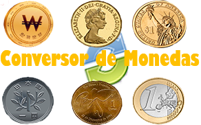
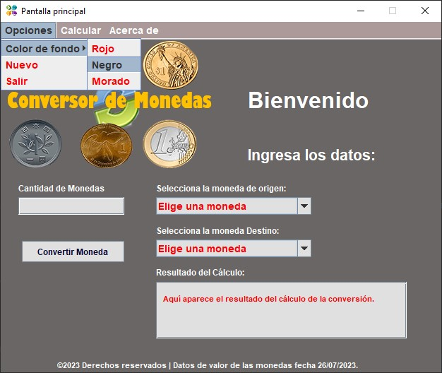
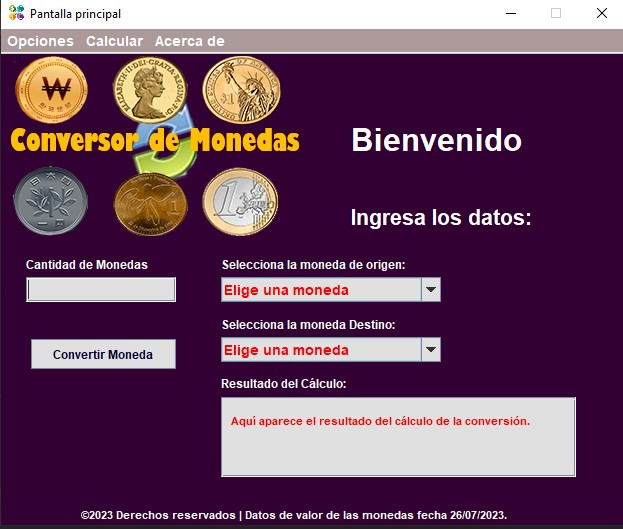

<h1 align="center"> Conversor de Moneda y Temperaturas </h1>

   

## Índice

* [Descripción del proyecto](#descripción-del-proyecto)

* [Estado del proyecto](#estado-del-proyecto)

* [Características y demostración del Proyecto](#características-y-demostracion-Proyecto)

* [Acceso al proyecto](#acceso-proyecto)

* [Tecnologías utilizadas](#tecnologías-utilizadas)

* [Personas Contribuyentes](#personas-contribuyentes)

* [Licencia](#licencia)

* [Conclusión](#conclusión)

# Descripción del proyecto
   
<dl>
  <dt>Sobre el desafío</dt>
  <dd> <tr></tr>
¡Bienvenido al primer desafío del Challenge Java de Oracle #Oracle_One #alura #Grupo5!
En esta oportunidad, a los Devs se nos solicitó crear un conversor de divisas utilizando el lenguaje Java. Las características solicitadas por nuestro cliente son las siguientes:

</dd>
  <dt>Requisitos:</dt>
  <dd>
El convertidor de moneda debe:
</dd>

        - Convertir de la moneda de tu país a Dólar
        - Convertir de la moneda de tu país  a Euros
        - Convertir de la moneda de tu país  a Libras Esterlinas
        - Convertir de la moneda de tu país  a Yen Japonés
        - Convertir de la moneda de tu país  a Won sul-coreano
<dd>
Recordando que también debe ser posible convertir inversamente, es decir:
</dd>

        - Convertir de Dólar a la moneda de tu país
        - Convertir de Euros a la moneda de tu país
        - Convertir de Libras Esterlinas a la moneda de tu país
        - Convertir de Yen Japonés a la moneda de tu país
        - Convertir de Won sul-coreano a la moneda de tu país
<dd>
Extras:
</dd>
<dd>
Como desafío extra te animamos a que dejes fluir tu creatividad, si puedo convertir divisas, ¿tal vez pueda añadir a mi programa otros tipos de conversiones como temperatura por ejemplo?
Es hora de sorprender a nuestro cliente con una función que tal vez ni siquiera sabía que necesitaba.
</dd>

</dl>

# Características y demostración del Proyecto

<dl>
  <dt>
Caracteristicas:
   </dt>

* La aplicación está desarrollada en java
* Utiliza la biblioteca Java Swing para las interfaces de usuario

<dd> Java Swing es una biblioteca de interfaz gráfica de usuario (GUI) que forma parte del conjunto de herramientas de desarrollo de Java.</dd>
<dd>Swing proporciona una serie de componentes de GUI que permiten a los desarrolladores crear interfaces gráficas interactivas para aplicaciones Java. Algunos de los componentes incluidos en Swing son botones, campos de texto, etiquetas, cuadros de diálogo, listas, tablas y más. También incluye contenedores como paneles y marcos para organizar y estructurar los componentes en una ventana.</dd>

</dl>
<dl>
    <dt>
    Demostracion de las funcionalidades del proyecto - Conversor de Monedas:
</dt>
<dd>

- `Ventana Principal del Conversor de Monedas`: Muestra la interfaz con la que el usuario interacturá para convertir una moneda a otra.   
</dd>

<dd>

- `Vista del menu Opciones`: El menu de Opciones cuenta con 3 submenus, el cual las funcionalidades son las siguientes: el submenu, Color de fondo: Permite cambiar el color del fondo del programa, 
el submenú Nuevo: permite limpiar la pantalla del resultado despues de haber realizado una conversión de moneda o temperatura y el submenú Salir: Permite salir del programa. 
Nota: Estás vista de los menus Opciones, Calcular y Acerca de, son para ambas funcionalidades del programa, convertir monedas y calcular la  temperatura.
</dd>

<dd>

- `Se Cambio el color del fondo de gris a color morado`
</dd>

<dd>

- `Probando la funcionalidad del conversor de monedas - Dolares a Quetzales`: Escribimos la cantidad a convertir, luego le especificamos la moneda de origen.
</dd>

<dd>

- `Probando la funcionalidad del conversor de monedas - Dolares a Quetzales`: Luego le especificamos la moneda de destino(a la moneda que será convertida el dolar).

</dd>

<dd>

- `Probando la funcionalidad del conversor de monedas - Dolares a Quetzales`: Luego de llenar los datos requeridos, Clic en el boton Convertir moneda, y listó obtenemos el resultado.
</dd>

<dd>

- `Salir del Programa: Dar clic en el Menu Opciones luego clic en salir para cerrar el programa`
</dd>

<dd>

- `Seleccionar la funcionalidad de Calcular Temperatura`: Clic en el Menu Calcular luego clic en Calcula Temperatura,
- El menu Calcular cuenta con las opciones de Calcular la Temperatua y convertir Monedas, por lo cual el usuario podra elegir dentro de esas 2 opciones. 
- Nota: Si el usuario está en la ventana de Conversion de Monedas, al dar clic en el menu Calcular solo le estará habilitado la opcion de temperatura, la opcion de convierte Monedas no estará habilitado debido a que actualmente se encontrará dentro de la ventana del conversor de monedas.
</dd>

<dd>

- `Luego de dar Clic en la opcion Calcular Temperatura`: Se verá la ventana de Calcular la temperatura.
</dd>

<dd>

- `Funcionamiento de la opcion de calcular Temperatura`: Ingresamos los datos: Ingresamos la temperatura, seleccionamos el origen de la temperatura ingresada, luego seleccionamos la temperatura destino, la que tendremos de resultado.
</dd>

<dd>

- `Resultado de Calcular Temperatura`: Luego de haber ingresado la temperatura y haber seleccionado la temperatura origen y destino dar clic en Calcular, para obtener el resultado.
</dd>

<dd>

- `En el submenú Nuevo del Menú Opciones`: Permite borrar(limpiar) los datos ingresados anteriormente y las opciones seleccionadas de la temperatura o moneda de origen y destino.
</dd>

<dd>

- `En el submenú de el creado del Menu de Acerca de `: Muestra información del creador del programa.
</dd>

<dd>

- `Video del funcionamiento `
</dd>

</dl>

# Tecnologías utilizadas
    - Java 17 y la biblioteca Java Swing.

* Enlaces de Referencia:
  * `Informacion para crear un readme:`
    * Plataforma para hacer un readme online: 
      * https://pandao.github.io/editor.md/en.html
    * Data guia sobre readme 
      * https://www.markdownguide.org/extended-syntax
      * https://www.aluracursos.com/blog/como-escribir-un-readme-increible-en-tu-github

    * Agregar video al readme: 
      * https://www.configuroweb.com/como-colocar-video-de-youtube-en-el-archivo-readme-en-github/
  * Enlaces de requerimientos del programa:
    * https://trello.com/b/PYUdAu0K/conversor-de-moneda-challenge-one-java

# Personas Contribuyentes
## Autores

| [ Gerson Escobedo](https://github.com/gerson121295)

# Estado del Proyecto

   

# Licencia

  
License: [MIT](License.txt)

# Personas Desarrolladores del Proyecto

# Conclusión
    Este proyecto fue interesante ya casi nunca habia utilizado Java Swing la cual permite dejar volar la imaginacion, al momeno de crear las interfaces del usuario y agregarle eventos a los botones.
    Es la primera vez que realizó un readme.md es lo que mas tiempo me tomó y no quedó tan bonito.

